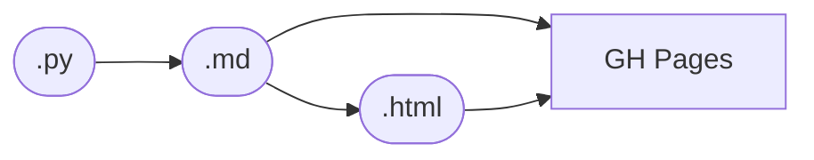

# Publish Markdown versions of reports

Include a .md version of each report in our site builds, to make it easy for agents to read them — and include a link the `head` of the HTML export to that Markdown file.

In fact, it might be nice if we got rid of the Marimo-native exports, and _always_ go via a plain Markdown file: we don't use the interactive features anyway. Then they would load faster, and they would look the same as our plain `.md` files (like `index.md`).

And update the skills to read the Markdown files instead of the Python files when gathering information. Otherwise, agents spent time and tokens trawling through the notebooks looking for the prose.
